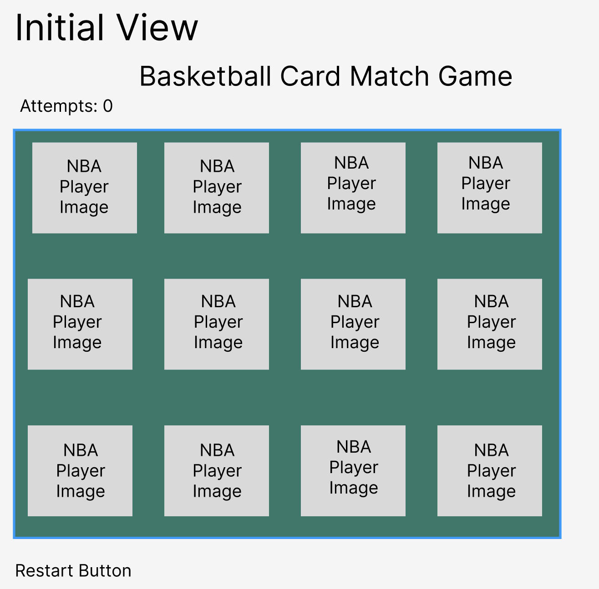
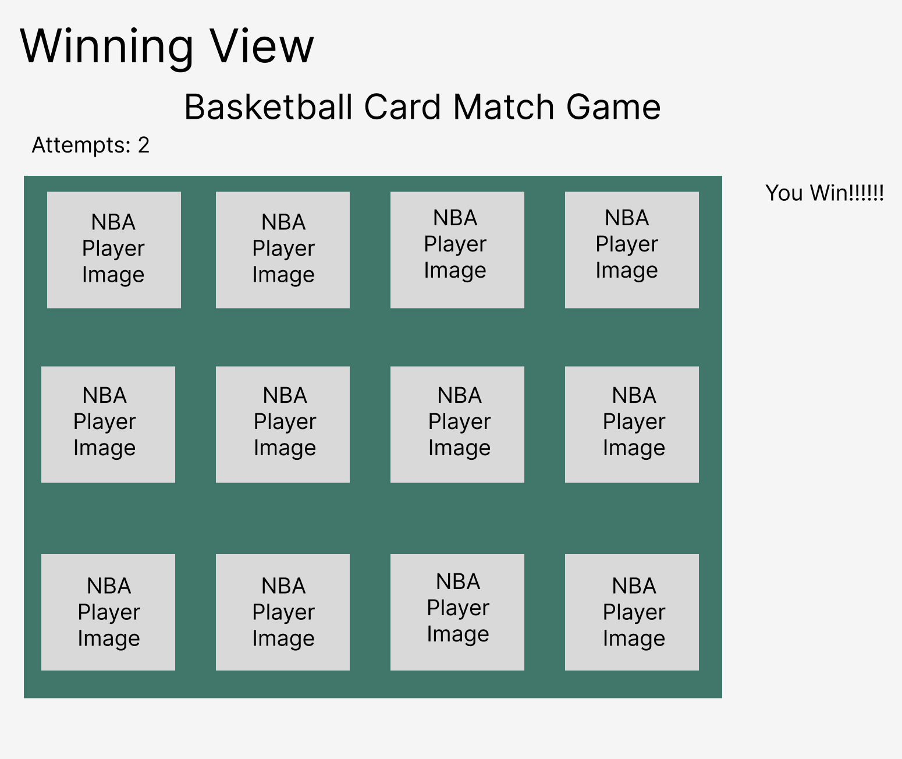
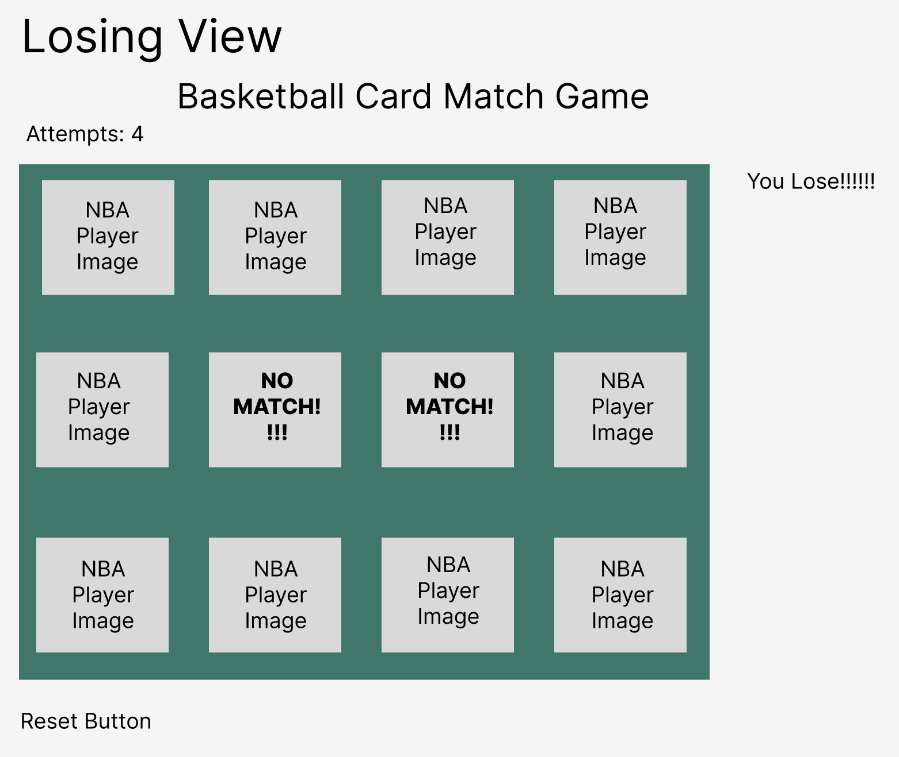

# Project Proposal

## Basketball Memory Match Game 🏀

## Project Description

My app is called Basketball Memory Match. It's a game app for players who love basketball and also enjoy testing their memory skills. Players can flip two images at a time to find matching pairs. The game is designed for single players, with the goal of finding all matches in the fewest moves possible. The game features an NBA theme that will display NBA players images. If a player matches a pair within their alloted moves, they win, if not, they lose. Players will have the ability to reset the game and try again to potentially win! So without further ado, lets get it!
## Wire Frames







## User Stories

### MVP Goals

- As a user, I want to start a new game so that I can play Basketball Memory Match Game.
- As a user, I want to see a grid of facedown cards so that I can start matching pairs.
- As a user, I want to click on a card to flip it over so that I can see the image on the other side.
- As a user, I want to be able to flip a second card to find a match so that I can progress in the game.
- As a user, I want matched cards to stay face up so that I can see my progress.
- As a user, I want unmatched cards to flip back over so that I can try again.
- As a user, I want to see a message when all pairs have been matched so that I know I've completed the game.
- As a user, I want my game attempts to be counted so that I can track my performance.
- As a user, I want a reset button so that I can restart the game at any time.

### Stretch Goals

- As a user, I want background music and sound effects to enhance the gameplay experience
- As a user, I want to be able to select the NBA player cards I want to match

### Pseudo Code:

```javascript
//Setup initial variables and constants:

//DECLARE board as an array
//DECLARE turn as string
//DECLARE moves as integer
//DECLARE matchedPairs as integer
//DECLARE IMAGES as array of NBA player images
//DECLARE board as an array
//DECLARE TOTAL_PAIRS as integer equal to the number of pairs needed

//Cache DOM elements:

//DECLARE startButton 
//DECLARE resetButton
//DECLARE messageEl
//DECLARE moveCounterEl
//DECLARE gameBoardEl
//DECLARE cardEl

//Event Listeners:

//ADD event listener to startButton for click to startGame function
//ADD event listener to resetButton to resetGame function
//ADD event listener to each cardEl for click to handle card click function

//Start Game Functionality:

//Function startGame
//Function initGame
//Function loadImages
//Function Random-Shuffle Images

//Rendering the Game Board:
//Function RenderBoard
//Loop through board array

//Handle Card Clicks & Matching Logic:

//Conditionals to check IF card was clicked to flip card
//Else do not flip card
//Check for match

//End Game & Reset Functionality:

//Function End Game
//check for winner
//check for loser

//Function Reset Game
```
### To-Do-List: 
[Project Management Notion Link](https://factual-birth-40e.notion.site/To-Do-List-for-Basketball-Memory-Match-Game-31900040e64e4f78be9497cb54130c9f)

### Timeline-Daily Accountability

| Day        	| Task                                                   	| Blockers 	| Notes/Thoughts 	|
|------------	|--------------------------------------------------------	|----------	|----------------	|
| Friday     	| Create and present proposal/Create html, js, css files 	|          	|                	|
| Saturday   	| Create basic scaffolding                               	|          	|                	|
| Sunday     	| Add functionality                                      	|          	|                	|
| Monday     	| Add styling                                            	|          	|                	|
| Tuesday    	| Finalize MVP                                           	|          	|                	|
| Wednesday  	| Work on stretch goals                                  	|          	|                	|
| Thursday   	| Work on icebox items if applicable                     	|          	|                	|
| Friday     	| Presentation Day!                                      	|          	|                	|